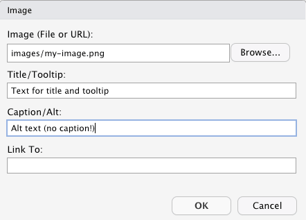

## Markdown via Addins 'Insert Image'

Using the RStudio Addin window without the width or height parameter it just generate markdown code. Is the width or height parameter included then HTML is generated but without `div.figure` and `p.caption` class. There is no caption visible and the CSS styling has to be done with `` tag.

### Example


{} You can't use the Addins 'Insert Image' in Visual R Markdown mode because it protects the conversion by adding a backslash in front of the squared brackets: `!\[Alt text\](images/my-image.png)`.{}

### Code in markdown

The first line is the markdown code for images without width/height parameters. The second line has a width parameter.

    
     

### Code in HTML

The first line is the HTML code for images without width/height parameters. The second line has a width parameter.

    <p></p> 
    

### CSS

If the RStudio Addin window is used, then the `img` tag should be wrapped into a paragraph. Otherwise it would be generate a conflict with other tags related with images.

```{css}
p img {
    border: 1px;
    border-style: groove;
    box-shadow: 0 4px 8px 0 rgba(0, 0, 0, 0.2), 0 6px 20px  rgba(0, 0, 0, 0.19);
}

```

### Summary

So -- all in all -- the Addins window is not very useful. The only advantage is the generation of the filepath and the copy of the image in the correct folder.

-   **Caption**: yes
-   **Format of caption**: yes
-   **Caption automatically numbered**: no
-   **Alt**: no
-   **Title**: no
-   **Tooltip**: no
-   **Width/Height**: yes
-   **Link to**: no
-   **ID**: no
-   **Classes**: no
-   **CSS style**: no
-   **Other** (key=value): no

## Visual R Markdown via Menu 'Insert ...'

With a `.md` file Visual R Markdown offers only a reduced first part of the window as it is presented in an `.Rmd` file. In contrast to the .Rmd version it lacks the fields to add width and height parameter.



But more important: There is no `caption`! The text for the field 'Caption/Alt' includes the text only for the `alt`-attribute!

### Example


### Code in markdown

    

### Code in HTML

    <p></p>

### CSS

The same as with the RStudio Addin window.

### Summary

-   **Caption**: no
-   **Format of caption**: no
-   **Caption automatically numbered**: no
-   **Alt**: no
-   **Title**: yes
-   **Tooltip**: yes
-   **Width/Height**: no
-   **Link to**: yes
-   **ID**: no
-   **Classes**: no
-   **CSS style**: no
-   **Other** (key=value): no

## Hugo figure shortcut

In contrast to the .Rmd file we do not need to protect the shortcode. We can insert it either via the Visual R Markdown menu `Insert -> Shortcode` or write the code directly into markdown.

### Example



Everything I said about the features of the figure shortcode in the post [Images: From R Markdown to HTML format](../images-from-rmd-to-html-format/#example-3) applies for `.md` files as well.

### Summary

-   **Caption**: yes
-   **Format of caption**: no
-   **Caption automatically numbered**: yes (Academic theme)
-   **Alt**: yes
-   **Title**: no
-   **Tooltip**: no (zoomable)
-   **Width/Height**: yes
-   **Link to**: yes
-   **ID**: yes (Academic theme)
-   **Classes**: yes
-   **CSS style**: yes
-   **Other** (key=value): no

## Results and Conclusion

| Attribute    | Addin | Visual | Hugo | Remark                                          |
|--------------|:-----:|:------:|:----:|-------------------------------------------------|
| Caption      |   ❌   |   ❌    |  ✅   |                                                 |
| C. format    |   ❌   |   ❌    | ❌ 1  | 1\) standard = bold                             |
| C.numbered   |   ❌   |   ❌    | ✅ 2  | 2\) via 'Academic' theme                        |
| Alt          |   ❌   |   ❌    |  ✅   |                                                 |
| Title        |   ❌   |   ✅    |  ❌   |                                                 |
| Tooltip      |   ❌   |   ✅    |  ❌   |                                                 |
| Width/Height |   ✅   |   ❌    |  ✅   |                                                 |
| Link to      |   ❌   |   ✅    |  ✅   |                                                 |
| ID           |   ❌   |   ❌    | ✅ 3  | 3\) `figure-<caption text>` or 'Academic' theme |
| CSS          |   ❌   |   ❌    |  ✅   |                                                 |
| Other        |   ❌   |   ❌    | ✅ 4  | 4\) `target`, `rel`, `attr`, `attrlink`         |

**Table**: Features of different method of inserting images in `.md` files converting with Hugo/Goldmark to HTML

Only Hugo shortcode (with ID and numbered extension by the Academic theme) is the only real choice for figures equipped with all necessary attributes and nice styled.

<span class='Z3988' title='url_ver=Z39.88-2004&amp;ctx_ver=Z39.88-2004&amp;rfr_id=info%3Asid%2Fzotero.org%3A2&amp;rft_val_fmt=info%3Aofi%2Ffmt%3Akev%3Amtx%3Adc&amp;rft.type=blogPost&amp;rft.title=Images%20in%20.md%20Files&amp;rft.source=Thought%20splinters&amp;rft.rights=CC%20BY-SA%204.0&amp;rft.description=The%20post%20investigates%20different%20methods%20to%20include%20images%20in%20%60.md%60%20files%20and%20how%20they%20are%20treated%20in%20the%20Hugo/Goldmark%20conversion%20process%20to%20HTML.&amp;rft.identifier=post%2F2021%2F2021-05-06-images-in-md-files%2Fimages-in-md-files&amp;rft.aufirst=Peter&amp;rft.aulast=Baumgartner&amp;rft.au=Peter%20Baumgartner&amp;rft.date=2021-05-06&amp;rft.language=en'></span>
